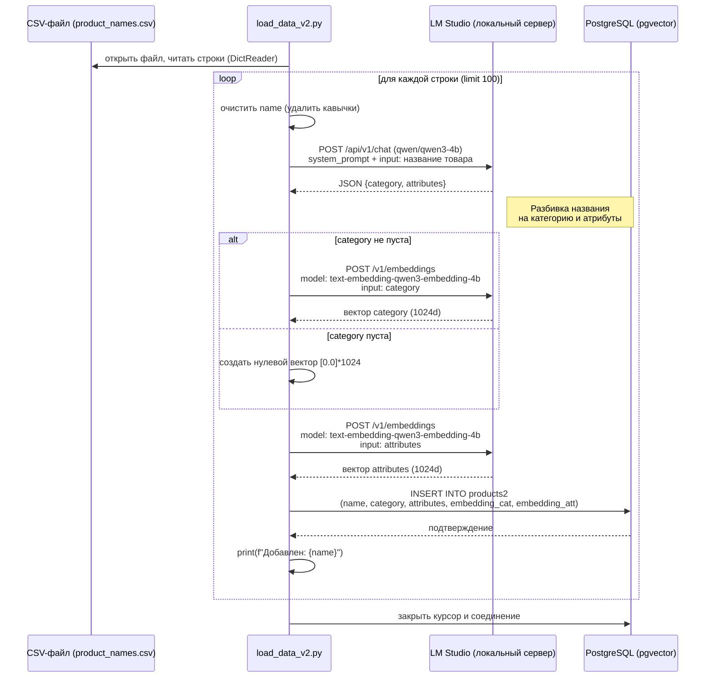
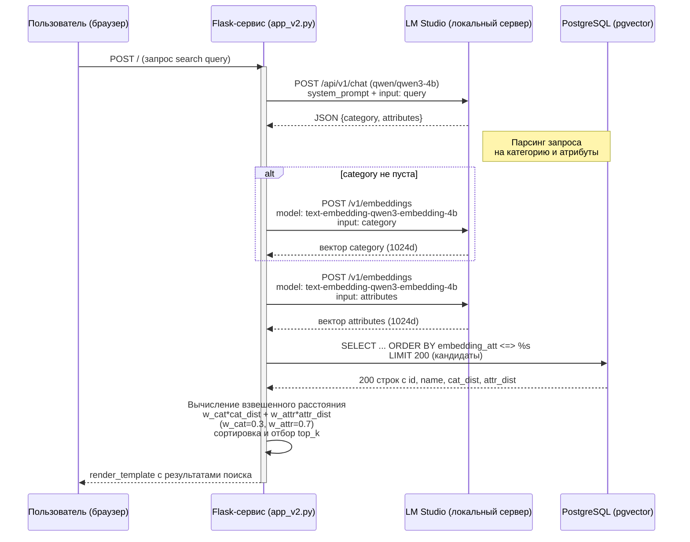

#### эксперименты с qwen-embedding

##### prepeqs
- PostgreSQL с pgvector
- модели для эмбеддинга и моделью общего назначения.

##### ADR
- запуск локальный, в докере БД PostgreSQL с pgvector.
- LMStudio с text-embedding-qwen3-embedding-4b и qwen/qwen3-4b

init_db_v2.py - создание схемы БД
load_data_v2.py - загрузка названий товаров из тестового набора и расчет векторов
app_v2.py - web-сервис с полем для ввода запроса и простым выводом результатов

##### install
- pip install -r requirements.txt
- в docker-compose.yaml установка postgres с локальным volume в папке проекта.

##### загрузка csv

##### поиск
